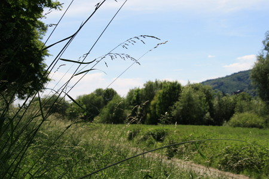

Es knallt. Ich höre nichts, höchstens einige Vögel zerstören durch ihr von Hormonen angeregtes Krakele die Stille. Ok, vielleicht ist da noch das Geplätscher der Straße hinter und der Lärm der Mosel vor mir. Ich liege dazwischen und einzig die Sonne knallt auf mich nieder. 
Ich liege in einer selbst ausgelegenen Lichtung im hohen Gras. Seit einer Stunde wälze ich mit meinem samstagnachmittaglich behäbigen Körper die Grashalme platt die meine Matratze bilden. Mein Bett ist leicht angekippt. Nach vorsichtigen Experimenten stellte sich heraus, dass es sich mit den Füssen nach unten besser liegt. Ein T-Shirt ist optional. Von dieser Liegeposition hab ich bei senkrechten Blick nach oben freie Sicht auf einen Grashalm, der meinen regenwaldkillenden Walzaktionen widerstanden hat. Dahinter ein Ast mit Blättern, hinter dem die Sonne hervor zu schauen beginnt. Dahinter – hinter dem Ast und nicht hinter der Sonne – schließlich ein blauer Himmel mit wenigen Wolken und unendlich langen Kondensstreifen. Hebe ich meinen Blick ist vor mir der Weg von dem ich gekommen und auf dem viele vorbei gegangen sind. Ich liege im Gras und döse mit Alanis.

Im Gras liegen und dösen. 
Im Gras liegen und dösen. Das ist ein Freizeitkonzept, ja fast eine Lebensphilosophie, die dem Trierer unbekannt scheint. Jedes Mitglied dieser Spezies Homo Sapiems Voyeurensis, dass auf diesem Weg an mir vorbei geht betrachtet mich. 
Das alte Ehepaar, das bei diesem Wetter viel zu dick angezogen ist.
Der Jogger in den viel zu kurzen Shorts. 
Die Fahrradfahrer, die gerade einen Mann im Rollstuhl überholen wollen und alle 20 min kommt eine pilgernde Gruppe Katholiken vorbei, die in Demut eine lethargische Liturgie nachsprechen und dem Herrn für den Tod seines Sohnes danken, auf dass sie nun deprimierende Laune verschleppend an einem sonnigen Samstagnachmittag durchs Grüne pilgern dürfen. Sie alle gucken. 
Im Gras liegen und dösen. Man hofft doch, dass es die natürlichste Sache der Welt ist.

Ein Stückchen weiter liegt Frido und verfolgt in diesem Moment die selbe Freizeitaktivität. Oder Passivität. Er döst. Das aber aktiv. 
Ich reiß ihm die Kopfhörer vom Kopf schreie ihn an und frage ganz leise warum alle denn so gucken. Er überlegt und antwortet. Hier wäre sonst nichts, auf der anderen Seite des Wegs sei nur ein meterweites Brennesselfeld. Dieser Argumentation war nichts mehr entgegen zu setzen. 
Jeder Vorbeigehende würde innerlich die Wahl haben starr gerade aus, uns oder die Brennnesseln anzugucken. Bei der Betrachtung dieser Optionen stellt sich heraus, das wir interessanter als Brennnesseln sind. Zugegeben eine ermunternde Feststellung nicht nur für das eigene Selbstwertgefühl, sondern auch für die Ehren- und Seelenrettung der Trierer, denen vielleicht doch die Chance bleibt hinter das Konzept von „Im Gras liegen und dösen“ zu kommen. Wenn mein Aufmerksamkeitsvorsprung gegenüber der Brennnesell nicht wäre, vielleicht würden sie ja die pure Tätigkeit ignorieren. Mir kommt der Gedanke die Leute durch all zu breites Grinsen zu verunsichern indem ich an die ignorierten Nesseln denke. Aber ich lass es und drück ihnen die Daumen, das sie beim heimlichen Trainieren von „Im Gras liegen und dösen“ sich das Kopfkissen nicht auf den Kopf legen. Vielleicht sollte ich auch nur mehr Zuversicht in diese Menschen zeigen. Immerhin, würde Deutschland und besonders Trier den neuen Im-Gras-Döser suchen und alle Gegner wären Brennnesseln würde ich gewinnen.

Damit schließe ich wieder die Augen, während das vorbeigehende Paar junger Damen die ihrigen wegdreht. Vielleicht ist ja noch nicht alles verloren in Trier.

<date>24. Mai 2009</date>
