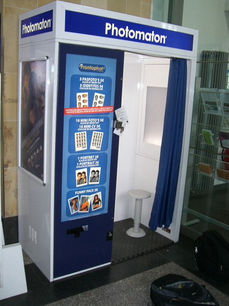
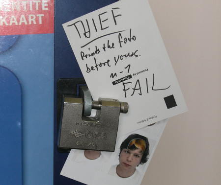

Diese Geschichte erinnerte mich an meine 8. Reise. War ich gewesen beim futurolgischem Kongress als Repräsentant von Spezies Mensch. Hatte ich dort kennen gelernt und bin ich zusammen geraten mit Spezies Tarrakaner. Sahen aus wie Automat von Kaffee, nahmen Münze, aber gaben nichts Getränk und verschwanden ohne Rückgabe von Silberstück. Waren Gauner rief ich hinterher.

Heute, ich möchte erzählen von Treffen mit Großcousin von Tarrakaner dem Photomaton. War ich mal nicht alleine ins Rakete, sondern hatte zu Gast Professor Taratongas Sohn Fridow. Wollten wir machen Bilder für galaktische Reisekarte für Kosmos. Brauchte man Lichtbild von sich jetzt gerade. Weil professionelle Caputphotofierer zu teuer und ich immer noch nicht Geld zurück von Tarrakaner, wir gingen zu semi-automatische Photographierkabine, weil ist billiger. Doch Kabine kein einfacher Photofierer, sondern war Falle vom Photomaton. 
Da ich, Ijon Tichy - großer Held von Kosmos - schickte ich Fridow vor um im Bauch des Automaten die Lage zu inspizieren und zu gucken, ob war sicher. Mutig handelte er und der erste Satz Photofien sollte kommen. Was aber kam sollte uns streben die Haare nach oben wie Katze wenn sauer. Waren es gar nicht Fridows Photofien, sondern die von anderer Person. Schnelliglich kombinierten wir, das waren Bilder von früheres Opfer des Photomatonen. Automat war auch Gauner und wenn du willst einmal Photofien, du musst machen zweimal Bilder. Das zweite Bild bekommt dein Nachfolger. Gauner! Wir schrieben mit Zettel dran, aber machten unsere notwendigen Photofien. Was sollten wir auch diskutieren. War Maschine sturr wie blöder Esel.

Gerade als wir wollten gehen von halsabschneidenden Automaten, kam ein weiterer Reisender dieses Zieles. Wollte auch machen Photofien, wir aber versuchten zu erklären, warum Maschine ist Gauner und Photofien machen ist keine gute Idee. Nur wir hatten ein Problem, wir nicht hatten gemeinsame Verständigung und auch Versuchen mit Hand und Fuss nicht konnten verdeutlichen unsere Warnung. Er betrat den Automat. Manchen nicht kann geholfen werden.

Später als wir wollten einsteigen in unser Rakete, wir nochmal sahen arme Wurst vom Ende stehen an Photoautomat und wundern über falsche Bilder. Ich nochmal dachte Gauner, wie Tarrakaner.

<date>24. Mai 2009</date>
